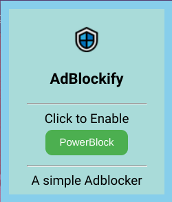

<a href="https://github.com/TamoghnaK13/AdBlockify">
  

 <h1>
    
  </h1>

  

    <strong>A simple AdBlocker for all your ad blocking needs that respects your privacy.</strong>
  

This is a simple Chrome Extension that you can trust that does not require special permissions.

  

I have recently made this extension, so be sure to check for updates!
>Email me at tamoghnak13@gmail.com if you want to collaborate!

## Features

<dl>
  <dt>Buttons</dt>
  <dd>
    It is a very simple ad blocker currently with only 2 options.
  </dd>
</dl>

<dl>
  <dt>Updates</dt>
  <dd>
Updates will come around once a month with new features, bug fixes, and other changes that are necessary.
  </dd>
</dl>
## TODO
- [ ] - Add an Element Remover
- [ ] - Add Improved UI
- [ ] - Improve Ad Blocking
- [ ] - Integrate a Youtube™ ad block.

____________________________________________________________________________________________________________________________________________________________________
This project is licensed under the [**MIT License**](https://en.wikipedia.org/wiki/MIT_License). 

If you have any questions or comments, please email me at tamoghnak13@gmail.com. I'd be happy to hear your thoughts.

[**Tamoghna Kommaraju**](https://github.com/TamoghnaK13), [**AdBlockify**](https://github.com/TamoghnaK13/AdBlockify)
